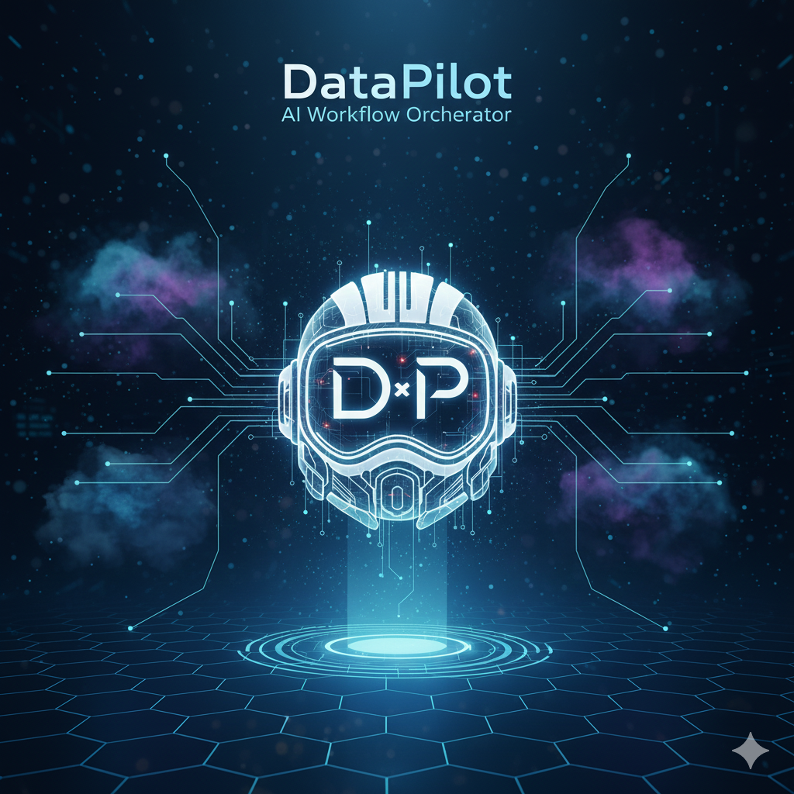
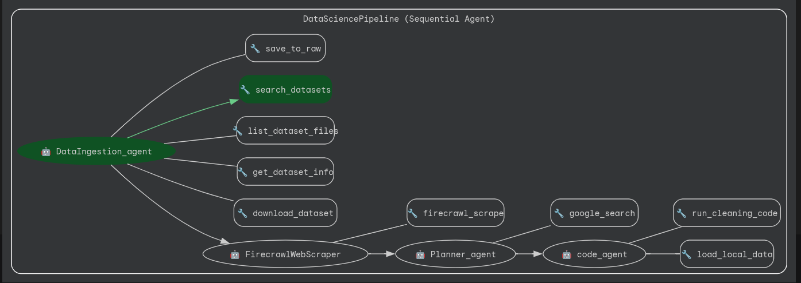

**Project Overview – DataPilot**

This project holds the core logic behind DataPilot, a multi-agent system built to automate the early, tedious stages of a data science workflow. It leverages the Google Agent Development Kit (ADK) and uses a sequential, modular pipeline to ingest, interpret, plan, and clean datasets autonomously.

---



### **Problem Statement**

Launching a new data science project comes with heavy “cold start” friction. Hours are wasted searching for datasets, downloading files, reading scattered documentation to understand columns, and writing basic cleaning scripts. These repetitive tasks are error-prone and drain effort before meaningful work—like analysis and modeling—can even begin. When repeated across experiments or multiple datasets, the process becomes chaotic and inconsistent.

---

### **Solution Statement**

DataPilot streamlines this zero-to-one phase by linking specialized agents. It can automatically search and download datasets from sources like Kaggle, scrape dataset pages for metadata and context, and produce a complete Machine Learning project plan based on that information. Beyond strategy, it generates and safely executes local Python code to clean and preprocess the data. This turns an unstructured first phase into a seamless pipeline, delivering a clean dataset and a practical ML roadmap so teams can jump straight to analysis.

---

### **Architecture**




At the center is the **DataSciencePipeline (Orchestrator)**—a structured, sequential multi-agent system. Instead of one large script, it chains agents that pass results to one another in a strict workflow. With the Google ADK, this setup gives fine-grained control over the data engineering process.

The Orchestrator_agent uses the ADK `SequentialAgent` class to enforce the flow:
**Ingestion → Scraper → Planner → Code Execution**

#### **Sub-Agent Roles**

**The Hunter — DataIngestion_agent**
Communicates with the Kaggle MCP Server to locate datasets and list files. It decides whether to simply gather metadata or to download files into the local `data/raw/` directory, establishing the project’s initial data access layer.

**The Researcher — FirecrawlWebScraper**
When a dataset link is found, this agent uses Firecrawl MCP to scrape the dataset page, extracting readable context such as column descriptions, license details, and usage guidance. It converts raw HTML/Markdown into structured summaries for downstream use.

**The Strategist — Planner_agent**
Acts as the lead Data Scientist. Using the scraped summary, it produces a detailed ML plan, including objectives, EDA strategy, model choices, and evaluation metrics. It strictly relies on real, scraped evidence and does not fabricate features.

**The Engineer — code_agent**
Executes the plan. It loads the downloaded dataset, inspects its structure, creates secure Python/Pandas cleaning code (handling nulls, duplicates, datatypes), executes it locally, and saves a cleaned version while logging every transformation.

---

### **Essential Tools and Utilities**

Agents operate through a mix of local tools and MCP servers.

**Kaggle & Firecrawl MCPs**

* `mcp_kaggle_server`: queries Kaggle directly for dataset searches and downloads.
* `mcp_firecrawl_server`: provides scraped web content transformed into LLM-ready context.

**Local File Operations**

* `save_to_raw`: saves downloaded binary streams.
* `load_local_data`: helps the code_agent inspect actual dataset contents (columns, types, etc.).

**Code Execution Tool — `run_cleaning_code`**
Runs generated Python cleaning scripts locally and saves output to `data/processed/`, returning a real cleaned file rather than just text output.

---

### **Conclusion**

DataPilot’s strength is its dependency-driven sequence. The Scraper depends on actual ingested data, the Planner depends on the Scraper, and code is only written after a validated plan. This avoids hallucinated assumptions and mirrors real data workflows. DataPilot demonstrates how ADK agents can coordinate local computing with external APIs via MCP to handle complex workflows that typically require constant human switching.

---

### **Value Statement**

DataPilot cuts the “time-to-code” from hours to minutes. Every project begins with a clear structure, a documented ML plan, and a properly cleaned dataset.

---

### **Installation**

Built for **Python 3.11+**

Create a virtual environment (via `uv`, `venv`, etc.), then install dependencies:

```
pip install -r requirements.txt
```

Store valid **Gemini, Kaggle, and Firecrawl API keys** in your `.env` file.

---

### **Running in ADK Web Mode**

From the working directory:

```
adk web --log_level DEBUG
```

---

### Author

**Developed by [Ayush Vishwakarma](https://github.com/AyushAI14)**


---